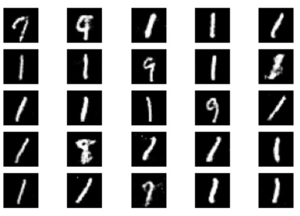
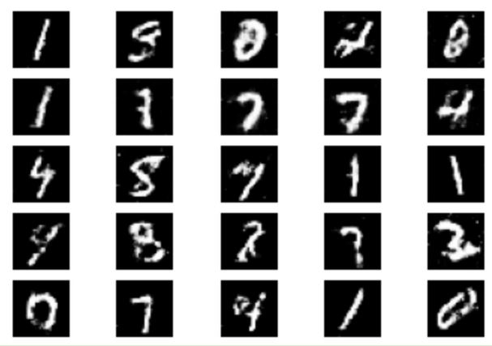
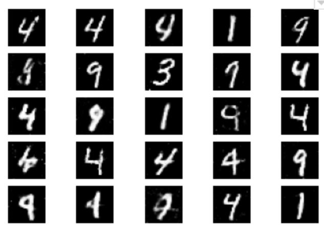
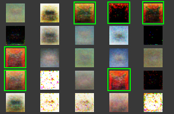
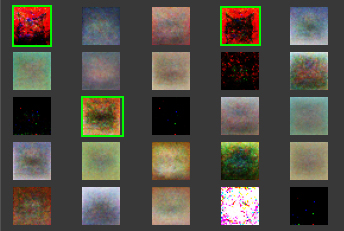

## **A Comparison of GAN and minibatch-GAN**

### **Introduction**
The goal of this projects is providing a comparison between simple GAN and the minibatch GAN. MNIST datasets have been used for this purpose.

This code has been gathered and developed for educational purposes by **Ali Rahmani Nejad** and **Zahra Sarlak**.

### **Experimentation Results**

Below, final results of using two different characters as the mode and showing the result of minibatch is showed. These images are generated by the Generator unit.

**Fig. 1**- Simple GAN - mode 1 - 10k iteration

**Fig. 2**- Minibatch GAN - mode 1 - 10k iteration

**Fig. 3**- Simple GAN - mode 4 - 10k iteration

**Fig. 4**- minibatch GAN - mode 4 - 10k iteration

It is clear that the appearance of the mode and the similarity of other generated images is reduced as well.

Below, is the result of the experiment on CFar10. It took a lot of time and the low quality is due to lack of time. The mode is Cat in thie following experiment result.

**Fig. 5**- Simple GAN - mode cat - 8k iteration

**Fig. 6**- minibatch GAN - mode Cat - 8k iteration

### **Note**
Please note that for running this code it is necessary to use tensorflow version 1.15. For setting the version to this run the command below. 

``pip install tensorflow==1.15``

It can be even written and ran in your colab notebook.

### **References**
This code has been gathered and developed with help of multipule good references and webpages including:

- Goodfellow, Ian. "NIPS 2016 tutorial: Generative adversarial networks." arXiv preprint arXiv:1701.00160 (2016).
- Salimans, Tim, et al. "Improved techniques for training gans." Advances in neural information processing systems. 2016.
- Gündisch, David, Writing your first generative adversarial network with keras, 20 Sep 2019 [link](https://towardsdatascience.com/writing-your-first-generative-adversarial-network-with-keras-2d16fd8d4889)
- Brownlee, Jason, How to Code the GAN Training Algorithm and Loss Functions, 12 July 2019 [link](https://machinelearningmastery.com/how-to-code-the-generative-adversarial-network-training-algorithm-and-loss-functions/)
- Hui,Jonathan, Ways to improve GAN performance, 19 Jun 2018 [link](https://towardsdatascience.com/gan-ways-to-improve-gan-performance-acf37f9f59b)
- Keras-ACGAN-CIFAR10 repository [link](https://github.com/King-Of-Knights/Keras-ACGAN-CIFAR10)
